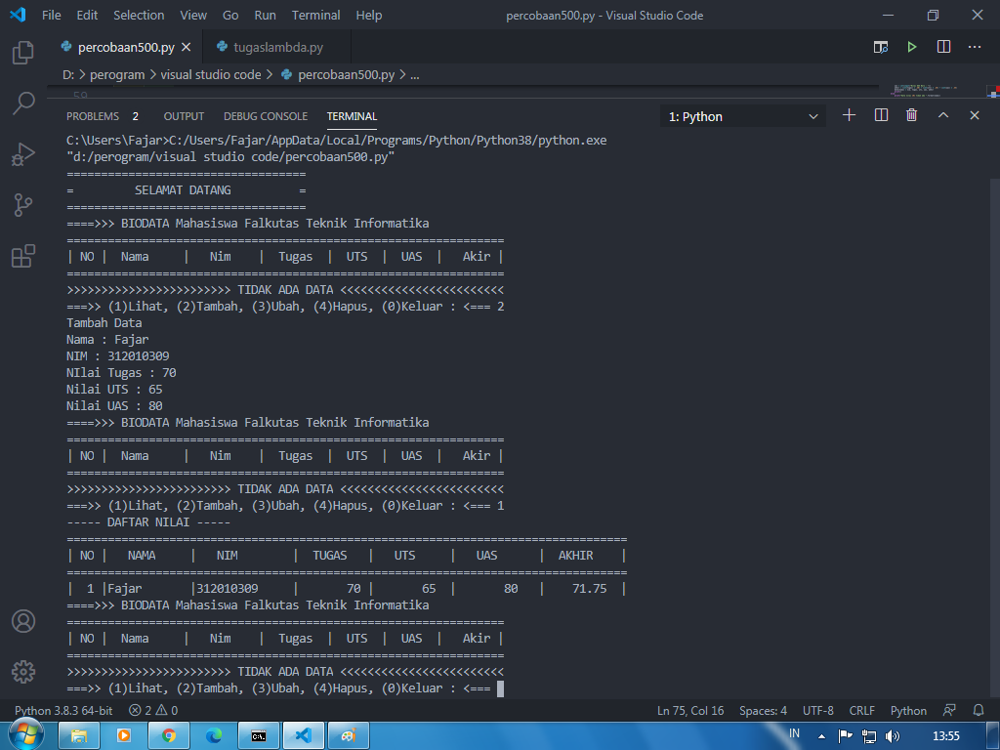

# Labspy 6

		# mengubah function menggunakan lambda
		def a(x):
    		    return x ** 2

		lambda x: x ** 2

		print("1. Mengubah function menggunakan Lambda \n   def a(x): \n \t   return x ** 2")
		print("   Hasil : lambda x: x ** 2")

		def b(x, y):
    		    return math.sqrt(x ** 2 + y ** 2)

		lambda x, y: math.sqrt(x ** 2 + y ** 2)

		print(35*"=")
		print("2. Mengubah function menggunakan Lambda \n   def b(x, y): \n \t   return math.sqrt(x ** 2 + y ** 2)")
		print("   Hasil : lambda x, y: math.sqrt(x ** 2 + y ** 2))")

		def c(*args):
   	     	    return sum(args) / len(args)

		lambda *args: sum(args) / len(args)
	
		print(35*"=")
		print("3. Mengubah function menggunakan Lambda \n   def c(*args): \n \t   return sum(args) / len(args)")
		print("   Hasil : lambda *args: sum(args) / len(args))")

	
		def d(s):
	   	    return "".join(set(s))

		lambda s: "".join(set(s))

		print(35*"=")
		print("4. Mengubah function menggunakan Lambda \n   def d(s): \n \t   return "".join(set(s))")
		print("   Hasil : lambda s: "".join(set(s)))")

Bila kita jalan kan kode diatas akan mengeluarkan Output seperti gambar di bawah ini

## Tugas pertemuan 10

* Gambar 1

* Gambar 2

* Gambar 3 

* Gambar 4

* Gambar 5

